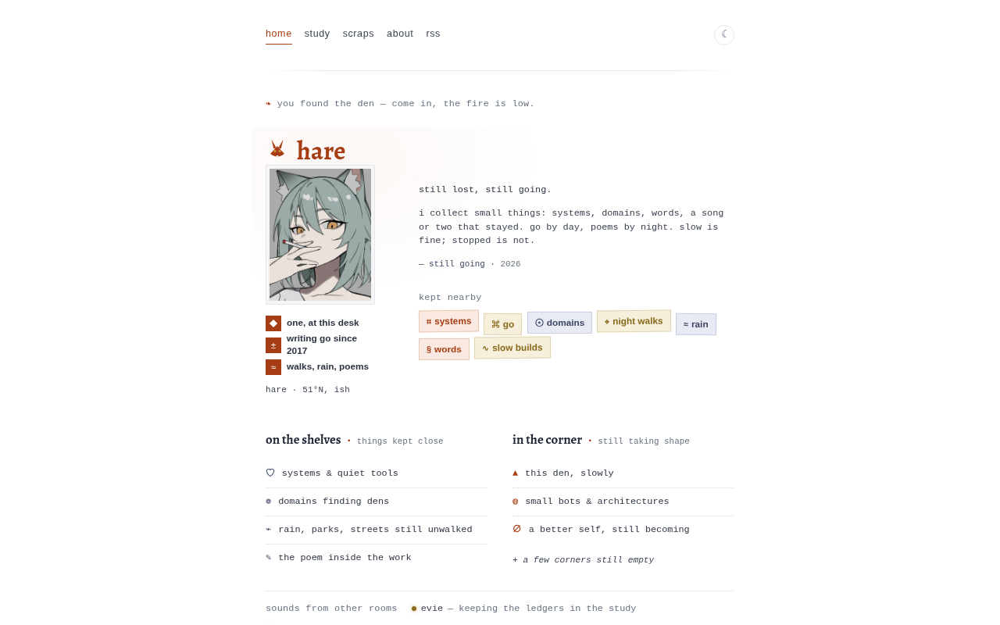

# lonefox

一套简洁的 Astro 博客主题。浅色 / 深色。一列，一个强调色。

[English](README.md)



可以直接克隆当模板，或作为依赖安装，在站点根目录放自己的 `lonefox.config.ts`。

## 特性

- Markdown 文章（`src/content/blog/`）
- 首页、书房、纸条、关于、404、RSS、sitemap
- 浅色 / 深色
- 一份配置：`lonefox.config.ts`
- 照片和狐狸标记走配置；照片路径为空则保留纸框

## 快速开始

```bash
git clone https://github.com/fennlee/lonefox.git
cd lonefox
npm install
npm run dev
```

需要 Node 22+。

## 作为依赖

```json
{
  "dependencies": {
    "lonefox": "github:fennlee/lonefox"
  }
}
```

在 `astro.config` 里从 `lonefox`（或 `lonefox/src`）引入。站点根目录放 `lonefox.config.ts`，主题以 `lonefox/config` 读取。文章写在站点自己的 `src/content/blog/`，照片放在站点自己的 `public/`。

## 目录

```text
/
├── lonefox.config.ts
├── src/
│   ├── content/blog/
│   ├── pages/
│   ├── layouts/
│   ├── components/
│   ├── lib/
│   └── styles/global.css
└── public/
```

文章字段：`title`、`date`、`description`、`category`（`tech` | `notes` | `travel` | `poem`），可选 `location`、`cover`、`images`。

`tech` 进 `/study/`，其余进 `/scraps/`。`/archive/` 会跳到 `/study/`。

## 配置

改 [`lonefox.config.ts`](lonefox.config.ts)：

| 字段 | |
|---|---|
| `site` | 站名、简介、域名、邮箱、github、favicon、页底年份 |
| `site.marks` | 可选 `wordmark` / `sleeping` / `paw` 图片路径（空则用内置狐狸 SVG） |
| `nav` | 导航 |
| `home` | 首页文案 |
| `home.portrait` | 首页照片（`src` 空则同尺寸纸框） |
| `about.photo` | 关于页照片 |
| `archive.photo` | 书房页头照片 |
| `scraps.photo` | 纸条页头照片 |
| `archive` | 书房标签 |
| `scraps` | 诗、出行、杂记 |

照片和自定义标记放站点 `public/`，配置里写路径。不要改主题源码来换站点样子。

颜色在 `src/styles/global.css`。

## 命令

| 命令 | |
|---|---|
| `npm run dev` | 本地预览 |
| `npm run build` | 生产构建 |
| `npm run check` | 类型检查 |
| `npm run preview` | 预览 `dist/` |

## 许可证

[MIT](LICENSE)
